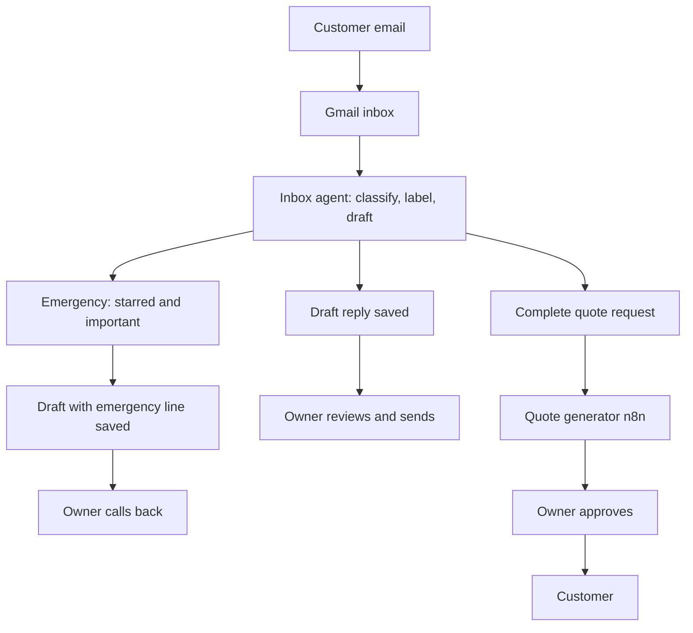
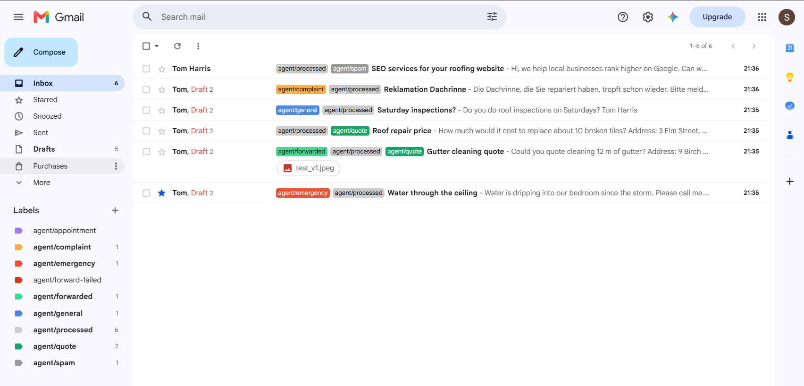
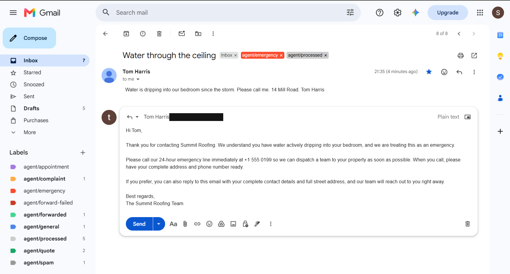
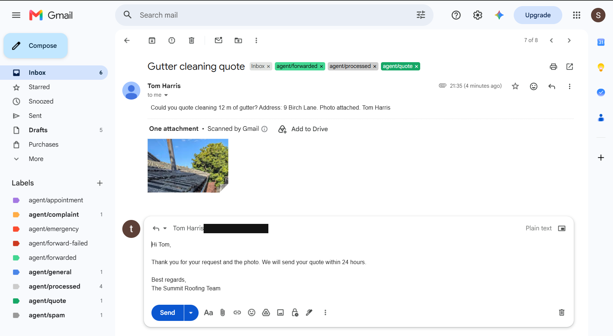
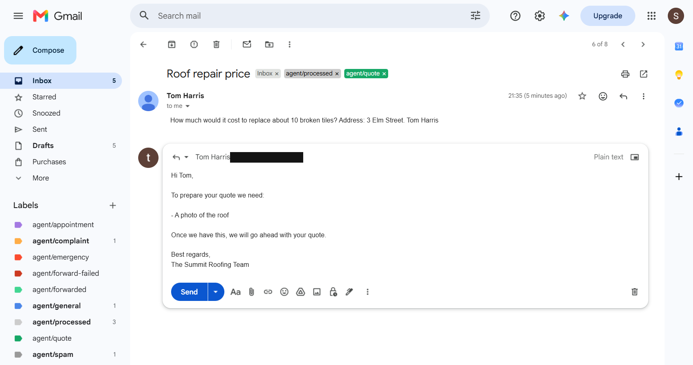
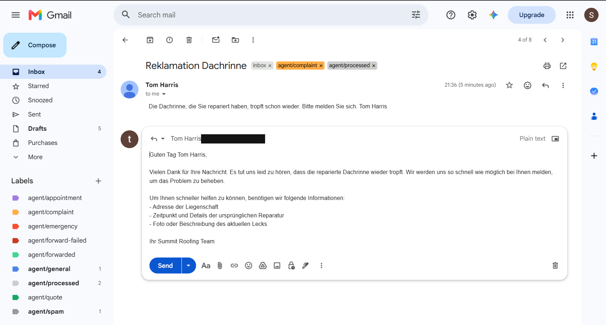
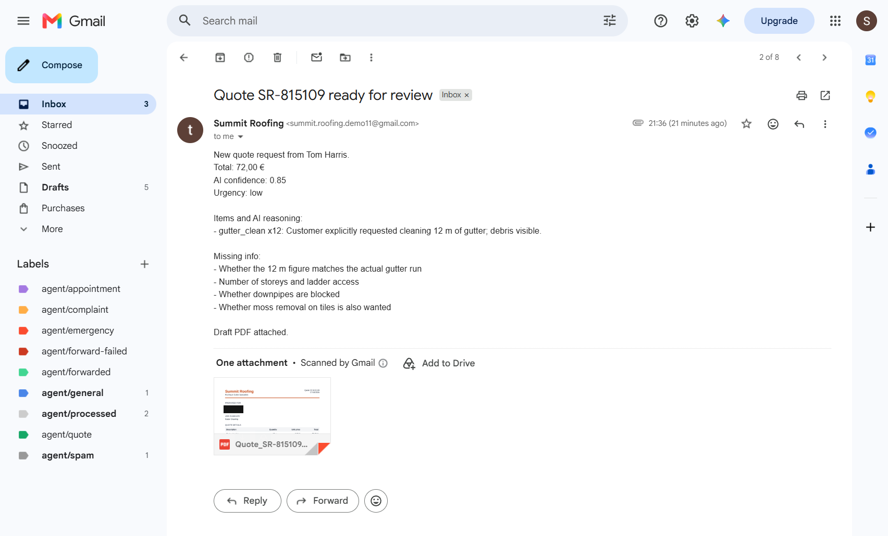
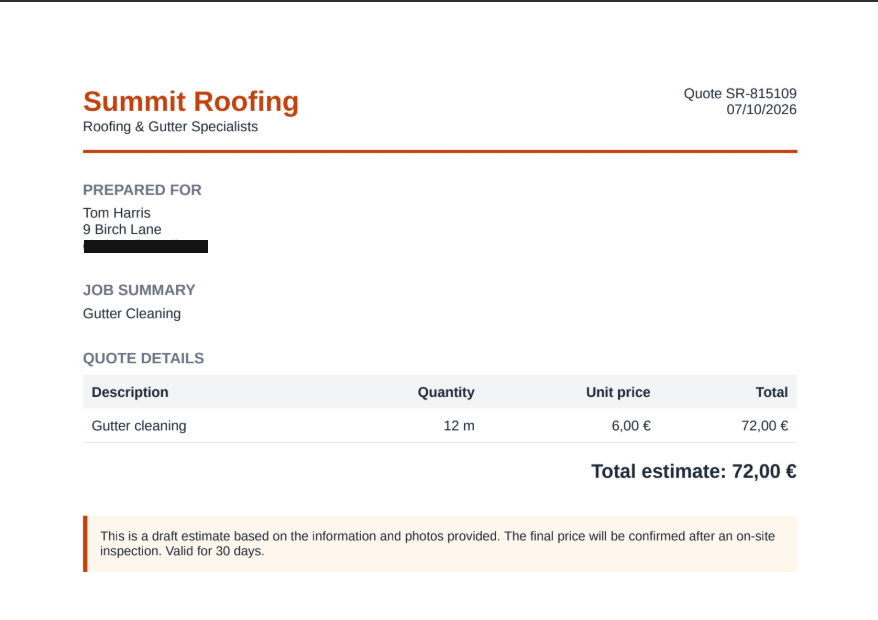

# Summit Inbox Agent

An AI assistant that reads a company's Gmail inbox, sorts each new email into one of six categories, and writes a reply as a Gmail draft. A person reviews every draft and sends it. The agent never sends anything to a customer.

For a business owner, that means: the inbox is sorted for you, emergencies are starred, and complete quote requests are passed to the quoting tool. Every reply still waits in your Drafts folder for you to approve.

## Part of the Summit Roofing AI back-office

This repository is one of two parts:

- **Inbox agent (this repo)**: reads and sorts the mail, and writes drafts.
- **[Quote generator](https://github.com/Uzelac97/summit-roofing-ai-quote-generator)**: an n8n workflow that builds quotes.

The two are connected by a webhook. When a customer's email is a complete quote request (it describes the job, gives an address, and attaches a photo), the agent posts the customer's own words, their details, and the photos to the quote generator's webhook. The request carries a secret key in an `X-Summit-Key` header, so the generator only accepts requests from this agent. The generator then prepares the quote and asks the owner to approve it before anything goes to the customer.

## How it works



The agent runs in the background, or once when you start it. Each pass reads mail that has not been handled yet, and for each email it:

1. Asks Claude (Anthropic's AI) to sort the email into a category, rate its urgency, pull out the customer's details, and draft a reply.
2. Adds a category label in Gmail, and stars the email if it is an emergency.
3. Saves the draft as a reply in the same Gmail thread.
4. Forwards complete quote requests to the quote generator.
5. Marks the email as processed, so it is not handled twice.

## Features

- **Six categories**: emergency, quote request, appointment, complaint, general, and spam. Each has its own coloured Gmail label.
- **Urgency rubric**: low, medium, or high, decided by physical damage and risk, not by how upset the customer sounds. High means water is getting in, the roof is open, or someone is at risk. Time pressure and an angry tone alone are never enough for high.
- **Replies in the customer's language**: by default a reply is written in the language the customer used. English and German are tested. The setting is in `config/company.yaml`.
- **Company facts only**: the agent answers from `config/company.yaml` (services, hours, response times, emergency number). If a fact is not in that file, the draft does not state it. It never quotes prices or promises a specific day or time.
- **Fixed acknowledgement for complete quote requests**: the reply is a set template, not model output, so the agent cannot keep asking for more details once it has what it needs.
- **Emergencies stand out**: starred and marked important in Gmail, so they appear at the top of the inbox whatever view you use.
- **Idempotent processing**: each email is handled once. The agent labels it `agent/processed` only after the draft exists, so an email that fails part way is retried on the next pass rather than skipped.
- **Forwarding with a secret**: the webhook call carries a key in the `X-Summit-Key` header. If `QUOTE_WEBHOOK_URL` is set but `QUOTE_WEBHOOK_SECRET` is empty, forwarding is refused.
- **Least-privilege Gmail access**: the agent asks Google for two permissions, `gmail.modify` (read and label) and `gmail.compose` (create drafts). It does not request `gmail.send`, and no code path calls a send method. See the security note under Limitations.

## Evaluation

The evaluation set is 21 sample emails in `evals/cases.json`, with the correct answer written for each. `python evals/run_eval.py` runs the agent on all of them and scores it on:

- **Category**: is the email in the right one of the six categories?
- **Urgency**: is the urgency level right?
- **Customer name**: is the name taken from the email's sign-off, not the sender's display name, and is the greeting addressed to that name?
- **Draft rules**: no promised day or time, no questions when nothing is missing, sign-off in the same language as the draft, and a complete quote gets the fixed acknowledgement.

Current result (run on the cached analyses for the current prompt, so no new API calls):

| Check | Result |
| --- | --- |
| Category | 21 / 21 (100%) |
| Urgency | 21 / 21 (100%) |
| Both correct | 21 / 21 (100%) |
| Customer name | 6 / 6 correct |
| No time promises | 21 / 21 |
| No questions when nothing is missing | 1 / 1 |
| Sign-off matches draft language | 21 / 21 |
| Complete quote gets fixed acknowledgement | 1 / 1 |

These cases were used while the urgency rubric was being written, so treat 100% as a regression check, not a measure of accuracy on new mail. The eval set is small, and a result on unseen mail would be lower.

## Screenshots

Mail from a fictional customer, "Tom Harris", used to demo the agent.

**Inbox after a run.** Every new email gets a category label, and handled mail is marked `agent/processed`.



**Emergency.** The email is starred and marked important, and the draft gives the customer the 24-hour emergency line straight away.



**Complete quote request.** The customer has described the job, given an address, and attached a photo. The reply is the fixed acknowledgement, and the email is forwarded to the quote generator (`agent/forwarded`).



**Incomplete quote request.** The customer gave a price question but no photo, so the draft asks for what's missing instead of forwarding a quote request.



**Reply in German.** The customer wrote in German, so the draft follows in the customer's own language.



**Owner-side quote email.** The quote generator's result lands in the same inbox: the AI's reasoning, what's missing, and a draft PDF for the owner to review.



**Quote PDF.** The draft estimate attached to the email above.



## Setup

You need Python 3.13 (the version this has been run on), an Anthropic API key, and a Google account that owns the mailbox.

### 1. Google Cloud (Gmail access)

1. Sign in to [console.cloud.google.com](https://console.cloud.google.com) as the mailbox owner, and create a project.
2. Go to **APIs & Services > Library**, search for **Gmail API**, and enable it.
3. Go to **APIs & Services > OAuth consent screen**. Choose **External**, keep the publishing status as **Testing**, and add the mailbox address under **Test users**.
4. Go to **APIs & Services > Credentials > Create credentials > OAuth client ID**. Choose application type **Desktop app**, and download the JSON file.
5. Rename the downloaded file to `credentials.json` and put it in the project folder. Do not commit it.

### 2. Anthropic key

Create an API key at [console.anthropic.com](https://console.anthropic.com).

### 3. Install

```bash
python -m venv venv
venv\Scripts\activate            # Windows
# source venv/bin/activate       # macOS / Linux
pip install -r requirements.txt
```

### 4. Configure `.env`

Copy `.env.example` to `.env` and fill it in:

```
ANTHROPIC_API_KEY=sk-ant-...
QUOTE_WEBHOOK_URL=https://your-n8n-host/webhook/summit-quote
QUOTE_WEBHOOK_SECRET=a-long-random-string
```

Leave `QUOTE_WEBHOOK_URL` empty to turn forwarding off. `.env.example` lists the optional settings: `ANTHROPIC_MODEL` and `POLL_INTERVAL_MINUTES` (default 5).

The secret must match the one the quote generator checks. Generate a long random value for it, for example with `python -c "import secrets; print(secrets.token_urlsafe(32))"`.

### 5. First run (Gmail consent)

```bash
python -m src.gmail_client
```

A browser window opens. Sign in as the mailbox owner and approve the two permissions. This saves `token.json`, prints the mailbox address it reached, and lists recent subjects. It changes nothing in the mailbox.

### 6. Run the agent

| Command | What it does |
| --- | --- |
| `python run_agent.py` | One pass over unhandled mail, up to 25 emails. |
| `python run_agent.py --max-emails 50` | One pass, up to 50 emails. |
| `python run_agent.py --loop` | Repeats a pass every `POLL_INTERVAL_MINUTES` until Ctrl+C. |
| `python demo_run.py` | Runs the bundled sample emails through the classifier. Does not touch Gmail. |
| `python evals/run_eval.py` | Scores the agent against `evals/cases.json`. Uses the cache, so repeat runs are free. |
| `streamlit run app.py` | Opens a dashboard for reviewing analyses. Opening it makes no API calls. |

## Configuration

**A new business adopts the agent by editing `config/company.yaml`.** Nothing company-specific lives in the prompt, the code, or the evaluation set. The facts in that file go into the system prompt, and the agent answers from them and nothing else.

| Key | What it does |
| --- | --- |
| `name`, `tagline` | Used in the prompt and in the sign-off, e.g. "The Summit Roofing Team". |
| `language` | The company's own language, as an ISO code. |
| `reply_language` | `match_customer` (default) replies in the customer's language. `company` always uses `language`. A code such as `de` fixes it. |
| `currency` | For any figure the business states. The agent never quotes prices. |
| `contact.phone`, `contact.emergency_phone` | Given in drafts. The emergency number is given to every emergency. |
| `services`, `not_offered` | What to offer, and what to decline plainly rather than offer to arrange. |
| `service_area` | Leave as `{}` to serve customers anywhere. To restrict coverage, give a `description` and an optional `areas` list. The agent never declines an emergency on location grounds. |
| `hours`, `response_times` | Answered when a customer asks. Only the response times listed here may be promised. |
| `warranty`, `payment` | Guardrails: what the agent must not say (e.g. no warranty length, no prices). |
| `quote_acknowledgement` | The fixed text for complete quote requests, in English and German. |

Any change to this file changes the prompt fingerprint, so cached analyses are retired and the next run uses the new facts.

## Limitations

- **Roofing-specific categories.** The six categories and the urgency rubric are written for roofing: "emergency" means water entering a building or an exposed roof. Another trade would need the definitions in `src/classifier.py` changed. Everything else (identity, contacts, services, coverage, hours, language) comes from the config file.
- **Gmail OAuth in Testing mode expires weekly.** While the OAuth app is in Testing, Google expires its refresh tokens after seven days. When that happens, the agent drops `token.json` and asks for consent again on the next run. Publishing the app would remove the expiry, but the Gmail scopes are restricted, so that route means Google's app verification.
- **Single process only.** Run one agent at a time, either once or with `--loop`. Two runs at once can label or draft the same email twice, because they read the mailbox at the same time.
- **A failed forward is retried, not lost.** The agent saves the draft, then forwards. If the forward fails, `agent/processed` is withheld and `agent/forward-failed` (red) is applied instead, so the email is not picked up by the normal pass and does not get a second draft. Every later pass retries just the forward, before it looks for new mail, for up to 5 attempts total; a successful retry swaps the label for `agent/forwarded` and `agent/processed`. After 5 failures the label stays and the console prints a clear warning on every pass until someone looks at it. If the webhook accepts the request and the `agent/forwarded` label itself cannot be saved, the console says so and the label is missing - check the console output after each run for that case.
- **Security note on Gmail scopes.** `gmail.compose` is the scope needed to create drafts, and Google's definition of it also allows sending mail. The agent never sends, because no code path calls a send method, but that rule is enforced by the code, not by the permission. Narrowing the scope further would be a stronger guarantee; verify that the Gmail API still creates drafts under the narrower scope before changing `SCOPES`, since changing it forces a fresh consent.
- **Model choice.** The classifier forces a tool call, which newer Claude models reject. The default is Claude Haiku 4.5. See `.env.example`.
- **No phone alerts.** An emergency is starred in Gmail. A push notification to a phone is planned but not built.
